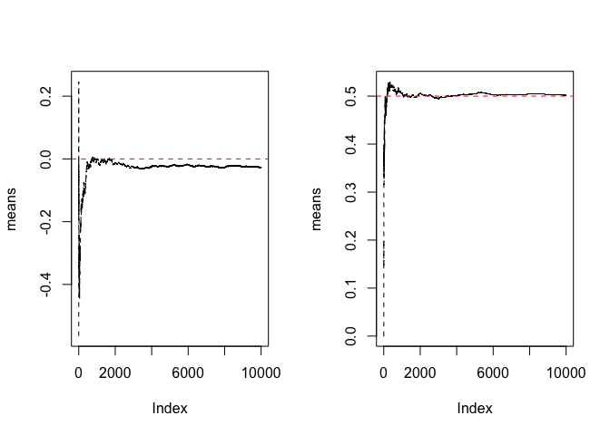

#Asymptotics 

**Asymptotics** also know as the **large sample theory**, refers to behavior of estimator as the sample goes to infinity. 
It is generic framework for assesment of properties of estimators and statistical tests. It is assumed that the sample size *n* grows indefinitely, and the properties of statistical procedures are evaluated in the limit as n → ∞ 

It is similar to **law of large number**, that states that for a sequence of **iid** (independent identical distributed) random variables X1, X2,the sample average X converge to the population mean , as sample size n → ∞ .

Lets, understand this by two plots in r.

1. Assume there are 10000 standand normals variables and try to plot the cummulative means and see the outcome. 

2. Fliping a coin n coin flips, the sample proportion of heads. As we flip a fair coin over and over, it eventually converges to the **true probability of a head** i.e. 0.5


```r
#Standard normal n =10000
par(mfrow=c(1,2))
n <- 10000
means <- cumsum(rnorm(n))/(1:n)
plot(means,type = "l", lty=2)
abline(h=0,col="red",lty=2)

# fliping a coin 10000 times
n =10000
means <- cumsum(sample(0:1, n, replace = TRUE))/(1:n)
plot(means,type = "l", lty=2)
abline(h=0.5,col="red",lty=2)
```

<!-- -->


We know from the **Central Limit Theorem** that for large n, the sample mean is normal with mean σ and standard deviation as σ/(√n).

In binomial distribution, *p* represents the *probability or proportion of success*, the variance σ^2 is p-2σ.
The standard error of the sample mean: σ/(√n) = √(p(1-p)/n)  


The 95% confidence interval of p is then given by p +/- 2σ or p +/- 2 *(sqrt(p(1-p)/n)

*As we know that 95% of the area under a normal curve is within 2σ of the mean*.A important concern is what is true value of p; that's what we're trying to estimate. 

**How can we compute a confidence interval if we don't know p(1-p)? **  

We could be conservative and try to maximize it so we get the largest possible confidence interval.Calculus tells us that p(1-p) is maximized when **p=1/2**, so we get the biggest 95% confidence interval when we set *p=1/2* in the formula p +/- (1/√n)

**Example :**
Suppose you were running for office and your pollster polled 400 people. Of these 240 claimed they were going to vote for you. You'd like to estimate the true proportion of people who will vote for you and you want to be 95% confident of your estimate.

**solution :**  
To be confident about the election it interval must be more than 0.5 

```r
##95% confidence level between
 240/400 + c(-1,1)* sqrt(1/400)
```

```
## [1] 0.55 0.65
```

